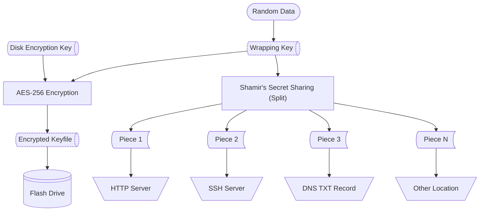
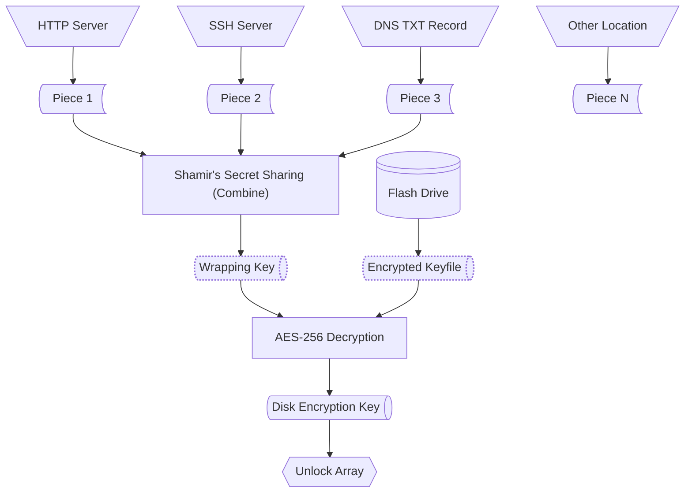

# How Automatic Disk Unlock Works

Automatic Disk Unlock uses **Shamir's Secret Sharing** to protect your disk encryption key, enabling automatic array unlock while maintaining strong security through distributed key storage.

## Overview

The automatic disk unlock process consists of two phases:

1. **Setup Phase**: Split your disk encryption key protection into multiple pieces
2. **Boot Phase**: Automatically retrieve and combine pieces to unlock your array

### Setup Process



During setup, automatic disk unlock performs the following steps:

1. **Generate a Random Wrapping Key**: A random AES-256 key is created to protect your disk encryption key.

2. **Encrypt Your Disk Encryption Key**: The plugin encrypts your existing disk encryption key using the wrapping key and stores it on the flash drive as an encrypted keyfile.

3. **Split the Wrapping Key**: Using Shamir's Secret Sharing, the wrapping key is split into multiple pieces. You configure:
    - **Number of pieces to create**: The number of pieces to create (e.g., 5)
    - **Number of pieces needed for unlock**: The minimum number of pieces needed to reconstruct the key (e.g., 3)

4. **Display Pieces**: Each piece is displayed once as a base64-encoded string. You must save these pieces to secure, accessible locations.

!!! info "Shamir's Secret Sharing"
    Shamir's Secret Sharing is a cryptographic algorithm that splits a secret into multiple parts. Any threshold number of parts can reconstruct the original secret, but having fewer than the threshold reveals nothing about the secret.

    For example, with a 3-of-5 configuration:
    
    - You create 5 pieces
    - Any 3 pieces can reconstruct the wrapping key
    - 2 or fewer pieces provide no information about the wrapping key

## Boot Process



At boot time, Automatic Disk Unlock automatically unlocks your array:

1. **Retrieve Pieces**: The plugin connects to the configured locations and retrieves the stored pieces.

2. **Reconstruct the Wrapping Key**: Once the threshold number of pieces is retrieved, Shamir's Secret Sharing combines them to reconstruct the original wrapping key.

3. **Decrypt the Keyfile**: The wrapping key decrypts the encrypted keyfile on the flash drive to obtain your disk encryption key.

4. **Unlock the Array**: The disk encryption key is used to unlock your encrypted drives, and the array starts automatically.

## Piece Storage

Each piece is a text file containing a base64-encoded string. You store these files in locations accessible during boot:

- **DNS TXT Records**: Pieces stored in DNS records that can be queried during boot
- **HTTP/HTTPS Servers**: Web servers hosting piece text files
- **SFTP Servers**: Secure file transfer protocol servers
- **SMB Shares**: Network file shares
- **S3-Compatible Storage**: Cloud storage buckets

The plugin uses [rclone](https://rclone.org/) for most retrieval methods, supporting numerous cloud and network storage backends.

## Security Considerations

### Advantages

- **Distributed Trust**: No single location stores enough information to decrypt your drives. An attacker would need to compromise multiple independent locations.

- **Resilience**: You can lose access to some piece locations (up to total pieces minus threshold) and still unlock your array.

- **Non-Invasive**: The plugin doesn't modify your disk encryption headers or drive configuration. It only adds a layer of protection for the keyfile.

- **Physical Security**: Even if someone steals your Unraid server, they cannot unlock the drives without accessing the threshold number of remote pieces.

### Important Notes

!!! warning "Piece Security"
    While individual pieces don't reveal the wrapping key, anyone with access to the required number of pieces and the flash drive can unlock your drives. Protect your piece locations appropriately:

    - Use authentication (passwords, SSH keys, etc.)
    - Store pieces in different administrative domains
    - Use encrypted connections (HTTPS, SFTP, etc.)

!!! warning "Availability"
    Your server cannot unlock automatically if it cannot retrieve the required number of pieces. Ensure your piece locations are highly available or configure enough redundancy.

!!! tip "Recovery"
    If you lose access to too many pieces, you can reinitialize the plugin with a new set of pieces. This requires your original disk encryption key/passphrase to unlock the drives manually.

## Piece Format

Pieces are base64-encoded strings that look like this:

```text
AQMAAAAAAKDHB8p/nfoghemaSx1vy7Yo1Twt0GfTVuZd6Nu9qjgKclw1CR/gUbLl84xhjz4dDoarD5edcKcdAf04TJ5HsgT6V+zjePFRUYC9QvlJrGsB+5ssBUVzxPjB4f5mblLWQqQbX6I3Dqwg1z9tRYo+lH29WfgkPIMuLr2E6SFgDaCr
```

Simply save each piece to a plain text file and upload it to your chosen storage locations. The plugin retrieves and decodes these automatically during boot.
