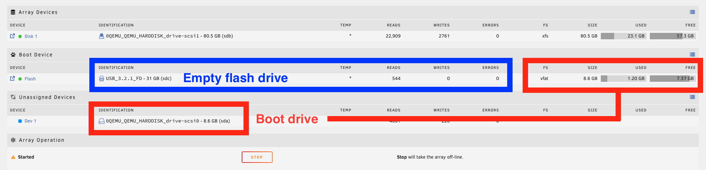

# Booting Unraid from a virtual SCSI drive

--8<-- "include/warning.snip"

!!! note
    - This works for VirtIO SCSI devices (e.g., virtual SCSI drives in Proxmox) in Unraid 7. Support for other SATA/SCSI drives (e.g., physical drives) requires a custom kernel that includes the relevant driver.
    - You still need a flash drive connected, but it is only used for the license.

## Instructions

1. Attach a virtual SCSI drive to the VM.
2. Create a single FAT32 partition on the drive:
   ```
   echo 'type=0c' | sfdisk /dev/sdX
   ```
3. Format the partition, setting the label to `UNRAID`:
   ```
   mkfs.vfat -n UNRAID /dev/sdX1
   ```
4. Stop the array.
5. Copy all files from the flash drive to the new partition:
   ```
   mkdir /tmp/UNRAID
   mount /dev/sdX1 /tmp/UNRAID
   cp -R /boot/* /tmp/UNRAID/
   ```
6. If you are booting with MBR:
   ```
   sh /tmp/UNRAID/syslinux/make_bootable_linux.sh /dev/sdb
   sfdisk -A /dev/sdX 1
   ```
6. Shut down the VM.
7. Detach the flash drive from the VM.
8. Start the VM.
   !!! note
       The system will report a registration error at this point; this is expected.
9. Reattach the flash drive to the VM.
10. Reformat the flash drive to remove all files:
    ```
    mkfs.vfat -n UNRAID /dev/sdY1
    ``` 
11. Reboot. Unraid now shows as registered.

## Result



- /dev/sda is the virtual drive that has the Unraid boot files (single VFAT partition, labeled UNRAID, with all of the files that would usually be on the flash drive)
- /dev/sdc is the USB drive attached to the license. It has a single VFAT partition, also labeled UNRAID, but has no files.
- System is licensed and array is started.