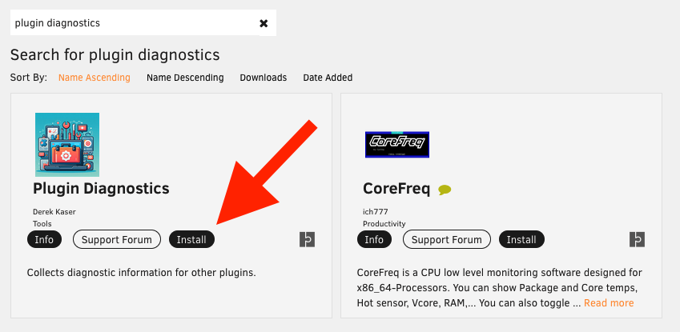
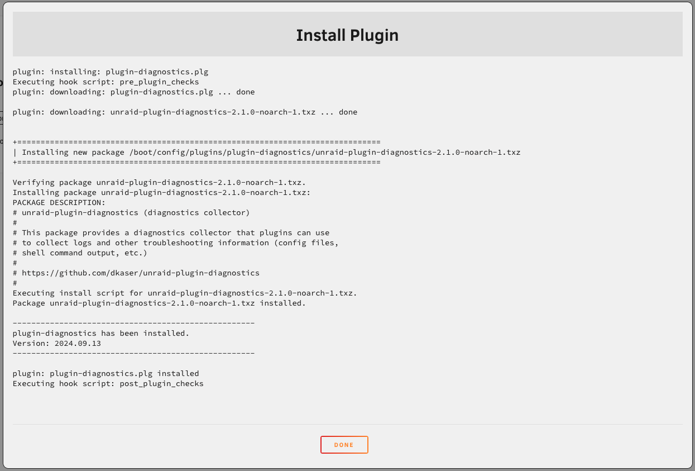
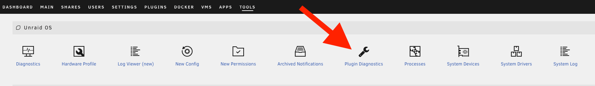
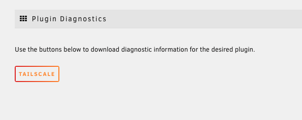

# Plugin Diagnostics: Usage 

## Installation

1. Log in to the Unraid server and switch to the **Apps** tab.
2. Search for and install **Plugin Diagnostics**.

    

4. Click **Done** once the window shows that Plugin Diagnostics has been installed.

    

## Downloading Diagnostics (GUI)

1. Switch to the **Tools** tab, then click on **Plugin Diagnostics**.

    

2. Click the button for the intended plugin.

    !!! note
        This only shows plugins that are configured to use Plugin Diagnostics.

    

## Downloading Diagnostics (CLI)

Plugin diagnostics can be created via CLI by running `plugin-diagnostics pluginName`. The resulting diagnostics will be stored in the **logs** folder on the flash drive.