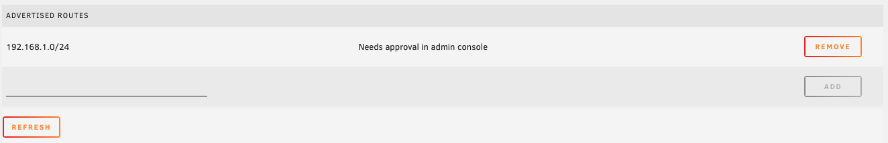

# Advanced Tailscale Settings

## Subnet Router

1. Open Tailscale settings.

    

2. Enter the desired route and click **Add**.

    

3. The routes will be displayed with a **Needs approval** message. The routes must be approved in the Tailscale
    admin console before they can be used.

    

4. Open the [Tailscale admin console](https://login.tailscale.com/admin/machines).
5. Locate the server in the machine list. It will have a blue **Subnets** badge with an exclamation point indicating
    that the server has routes that have not yet been approved.

    

6. Click the three dots at the end of the row, then **Edit route settings...**.

    

7. Check the routes to approve and save.

    

## Exit Node

1. Open Tailscale settings.

    
    
2. Click the **Enable** button next to **Run as Exit Node**.

    

3. The server will now advertise itself as an exit node. This must be approved in the Tailscale admin console before
    it can be used.

    

4. Open the [Tailscale admin console](https://login.tailscale.com/admin/machines).
5. Locate the server in the machine list. It will have a blue **Exit Node** badge with an exclamation point indicating
    that the server has not yet been approved as an exit node.

    

6. Click the three dots at the end of the row, then **Edit route settings...**.

    

7. Check **Use as exit node** and save.

    
