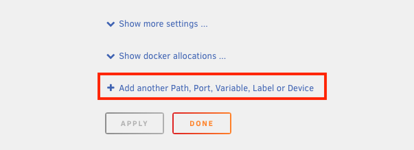
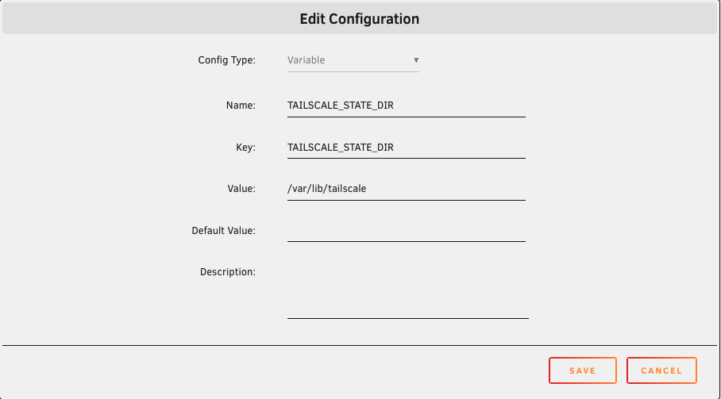
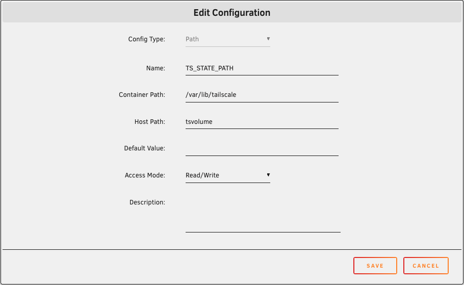

# Using the Tailscale Docker Mod for LinuxServer.io containers

1. Edit the Docker container that you wish to connect to Tailscale.

    

2. Add a variable:

    - Name: **DOCKER_MODS**
    - Key: **DOCKER_MODS**
    - Value: `ghcr.io/tailscale-dev/docker-mod:main`

    

3. Add a variable:

    - Name: **TAILSCALE_STATE_DIR**
    - Key: **TAILSCALE_STATE_DIR**
    - Value: `/var/lib/tailscale`

    

4. Add a path:

    - Name: **TS_STATE_PATH**
    - Container Path: `/var/lib/tailscale`
    - Host Path: A unique name to create a Docker volume for the Tailscale state.

    !!! note
        You can also use a filesystem path to create a bind mount instead of a Docker volume.

    

5. Apply the changes to the container.

    !!! warning
        If the Tailscale state variable or path are not configured, Tailscale will be logged out any time the container
        restarts.

    !!! tip
        If you would like to have Tailscale automatically log in instead of using the logs to get a login link, you can
        create an auth key from the Tailscale admin console and add another variable named `TAILSCALE_AUTHKEY`
        containing the key.

6. Open the logs for the container. Locate the line that says **AuthURL is**. Click the link to log in to Tailscale.

    

!!! tip
    The docker mod can be customized further using variables (e.g., to enable Tailscale serve). Refer to the
    [mod documentation](https://github.com/tailscale-dev/docker-mod/pkgs/container/docker-mod) for the complete list
    of variables.