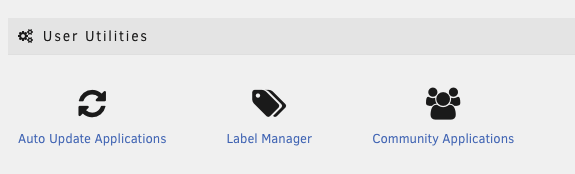

# Connecting Docker Containers via TSDProxy

## Installation

1. Install TSDProxy from Community Applications.

    

2. (Optional) Install Label Manager from Community Applications.
    - If you choose not to install Label Manager, see the instructions to manually configure the container.

3. In the Unraid WebGUI, open Settings -> Label Manager.

    

4. Select the container to configure.

    

5. Select the desired settings and click Apply. (Usually, this will just be the "Enable" option.) The container will be restarted to apply the updated labels.

    

6. Open the TSDProxy dashboard to connect the container to Tailscale:
    1. Click TSDProxy on the Docker tab, then WebUI

        

    2. Click the container, and log in to Tailscale.

        

### Manually Configuring Containers

1. Edit the container.
2. In the container settings, click Add another Path, Port, Variable, Label or Device.
3. Create a label to enable TSDProxy:
    - Config Type: Label
    - Name: tsdproxy.enable
    - Key: tsdproxy.enable
    - Value: true
4. Create a label to make the machine persistent:
    - Config Type: Label
    - Name: tsdproxy.ephemeral
    - Key: tsdproxy.ephemeral
    - Value: false
5. Save the container.
6. Open the TSDProxy dashboard to connect the container to Tailscale:
    - Click TSDProxy on the Docker tab, then WebUI
    - Click the container, and log in to Tailscale.
