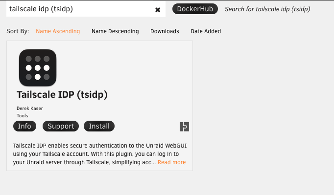
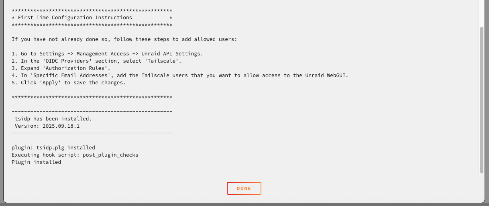
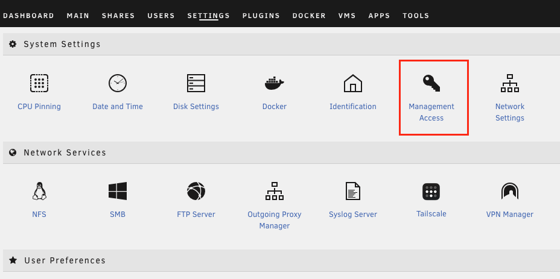
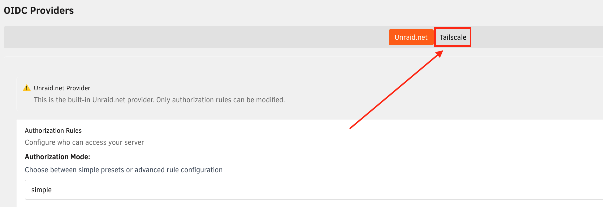
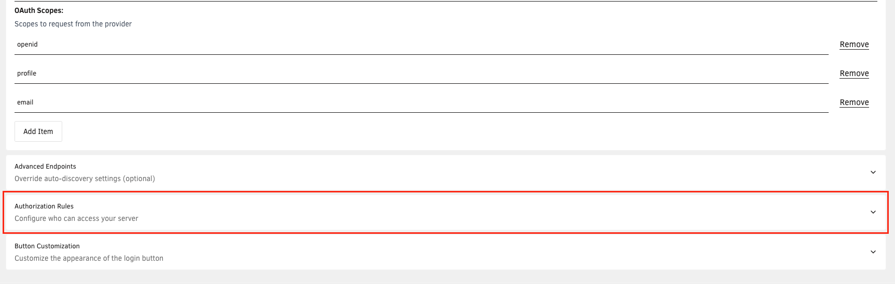
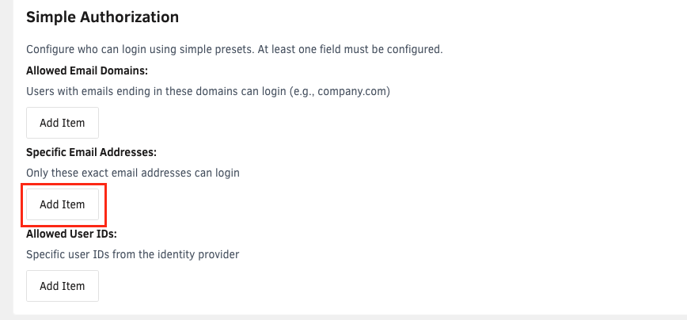
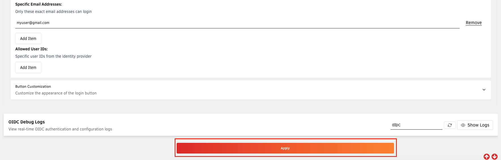
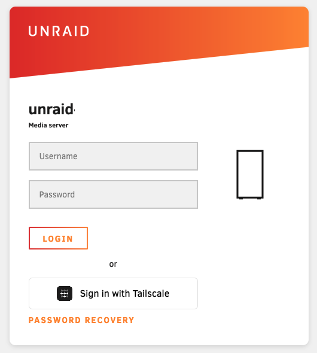

# Tailscale IDP Setup

Tailscale IDP allows you to automatically log in to the Unraid WebGUI when connecting via Tailscale.

!!! note
    - Tailscale must be installed and configured on your Unraid server.
    - HTTPS certificates must be enabled for your Tailnet via [https://login.tailscale.com/admin/dns](https://login.tailscale.com/admin/dns)
    - You must be running Unraid 7.2beta3 or later, or have the Unraid Connect Plugin version 2025.09.04.1949 or later installed.

## Install the TSIDP Plugin

1. Log in to the Unraid server and switch to the **Apps** tab.
2. Search for **tsidp**.
3. Install **Tailscale (Plugin)**.

    

4. Click **Done** once the window shows that Tailscale has been installed.

    

## Add Authorized Users

1. Switch to the **Settings** tab, then click on **Management Access**.

    

2. Under **OIDC Providers**, select **Tailscale**.

    

3. Expand **Authorization Rules**.

    

4. Under **Specific Email Addresses**, click **Add Item**

    

5. Enter the Tailscale user to provide WebGUI access.

    !!! tip
        Multiple users can be added if needed.

    !!! note
        This will usually be an e-mail address, but can vary for some tailscale accounts. For example, Github users appear as username@github

6. Click **Apply**

    

## Log in via Tailscale

Once Tailscale IDP is configured, a new button will appear on the WebGUI login page.

